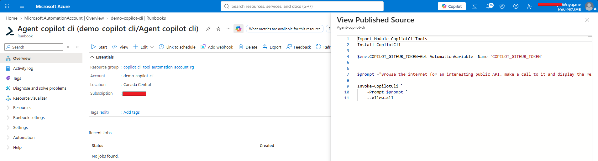
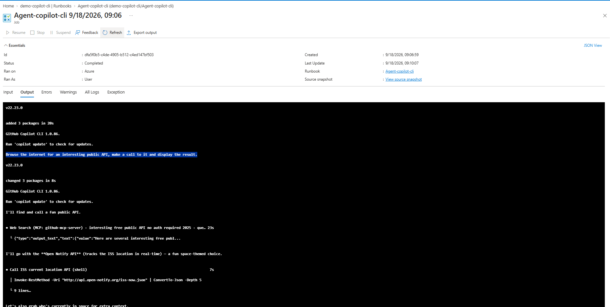
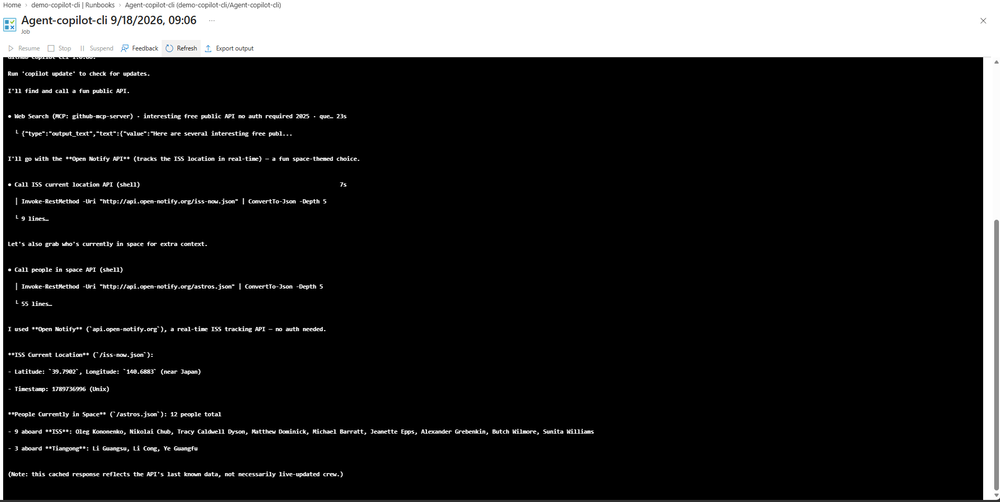

# CopilotCliTools

A PowerShell module that installs and runs a **portable Node.js runtime** and the **GitHub Copilot CLI** with no admin rights required — designed for unattended environments such as **Azure Automation** runbooks, build agents, and CI pipelines.

## Why

GitHub Copilot CLI normally requires Node.js and npm to be installed on the machine. In sandboxed/automation environments (Azure Automation, hosted agents, etc.) you often can't install system-wide software. `CopilotCliTools` solves this by:

- Downloading and extracting a self-contained Node.js distribution into a user-writable folder.
- Installing the `@github/copilot` npm package locally under that same folder (no global/admin install).
- Exposing a simple cmdlet to invoke the Copilot CLI with any flags you need.

## Requirements

- Windows PowerShell 5.1+ or PowerShell 7+
- Outbound internet access (to download Node.js and the npm package)
- A valid GitHub Copilot CLI authentication/token available to the process

## Versions

- **Node.js**: `22.23.0` (portable, pinned in the module)
- **GitHub Copilot CLI**: latest `@github/copilot` version available on npm at install time (not pinned)

## Installation

```powershell
Install-Module -Name CopilotCliTools -Scope CurrentUser
```

Or clone the repository and import it directly:

```powershell
Import-Module ./CopilotCliTools.psd1
```

## Functions

| Function | Description |
|---|---|
| `Install-PortableNode` | Downloads and extracts a portable Node.js runtime (no admin rights needed). Skips the download if already installed. |
| `Install-CopilotCli` | Ensures portable Node.js is present, then installs the `@github/copilot` CLI via npm into a local prefix. |
| `Invoke-CopilotCli` | Ensures the Copilot CLI is installed, then runs it with a prompt and any additional CLI flags. |

## Usage

### Run a prompt

```powershell
Invoke-CopilotCli -Prompt "List the files in the current directory"
```

### Pass additional Copilot CLI flags

Any extra arguments are forwarded as-is to `copilot.cmd`, so you can use the same flags you use locally, e.g. `--allow-all`, `--no-ask-user`:

```powershell
Invoke-CopilotCli -Prompt "Refactor this script" --allow-all --no-ask-user
```

### Install only, without invoking a prompt

```powershell
Install-CopilotCli
```

## How it works

1. `Install-PortableNode` downloads the official Node.js Windows x64 zip build into `%USERPROFILE%\tools\node` and adds it to the current process `PATH`.
2. `Install-CopilotCli` sets the npm prefix to `%USERPROFILE%\npm` and installs `@github/copilot` globally within that prefix.
3. `Invoke-CopilotCli` locates `copilot.cmd` under the npm prefix and executes it with `-p <Prompt>` plus any additional arguments you supply.

Both install steps are idempotent — if Node.js or the Copilot CLI are already present, they are skipped.

## Use case: Azure Automation

Since everything installs into user-writable folders (`%USERPROFILE%\tools\node` and `%USERPROFILE%\npm`) and requires no elevation, this module works well inside Azure Automation Hybrid Runbook Worker jobs or other locked-down execution environments where you cannot install software system-wide.

Create an Automation variable named `COPILOT_GITHUB_TOKEN` containing your GitHub Copilot token, then load it into the environment before invoking the CLI so it can be used for authentication:

```powershell
Import-Module CopilotCliTools
Install-Module CopilotCliTools

$env:COPILOT_GITHUB_TOKEN = Get-AutomationVariable -Name 'COPILOT_GITHUB_TOKEN'

Invoke-CopilotCli -Prompt "Browse the internet for an interesting public API, make a call to it and display the result." --allow-all
```

Example setup and output in Azure Automation:







## License

See repository for license details.
